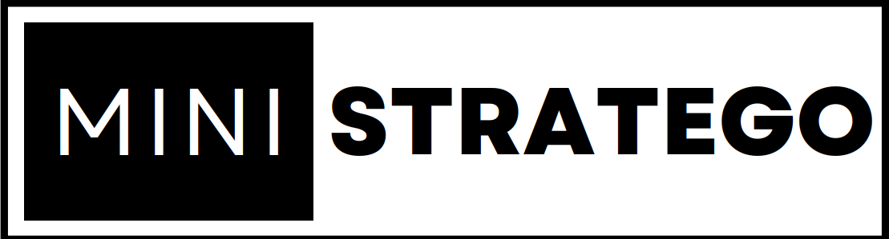

This is an Aleo implementation of a slightly smaller version of Stratego. The board is 6x6.

## Gameplay
The original Stratego is military themed, but we chose to use a __✅ crypto company ✅__ theme for our mini implementation. Each side has the following pieces:

| Name        | Description      | Quantity  | Strength
| ------------- |:-------------:|:-----:| -----:|
| Flag      | goal is to capture it | 1 | N/A |
| Hash puzzle      | so tough that only a miner can solve (aka capture) it      | 3 | 10 |
| Whistleblower | are neat      | 1 | 1 |
| Intern | are neat      |   2 | 2 |
| Miner | are neat      |   2 | 3 |
| Dev | are neat      |   2 | 4 |
| CEO | are neat      |  1 | 5 |

A corollary is that at the beginning, each player has 16 pieces on their board and 24 empty squares (the opponent's pieces are not noted).

The game flow:
1. Each player decides on a configuration for their pieces.
2. Players send each other commitments to their piece configuration (`commit_board`).
3. Player 1 makes a move and sends player 2 a proof that the move was valid and a commitment to their new position (`update_state`).
4. Player 2 makes a move and sends player 1 a proof that the move was valid and a commitment to their new position (`update_state`).
5. Repeat steps 3 and 4 until a player decides to attack. In case of an attack, both sides need to reveal the type of the piece that is attacking/being attacked (`reveal_piece`). The weaker piece gets killed (`update_state`), and if the attacker piece was the stronger piece, then it moves to the victim's position (`update_state`).
6. Repeat steps 3, 4, and 5 until a flag is captured.


##### SAMPLE GAME 

## Functions
We took great care in minimizing the computations done by the zk circuits. Below are details about each function.
* `update_state`: When a player's piece configuration changes, the commitment to their old board is no longer relevant. So, they need to generate a new one. A piece configuration can change if 1) a piece simply gets moved, 2) a piece gets attacked by a stronger piece and killed, 3) a piece tries to attack a stronger piece but gets killed, 4) a piece attacks a weaker piece and replaced it on the board. This function proves that the board being updated is the board representing the last state of the piece configuration before the update. It then moves or removes the relevant piece on/from the board as necessary.
* `reveal_piece`: When a piece attacks/gets attacked by another piece, both players need to announce the types of their pieces. The strengths of the pieces then get compared. This function reveals the type of the piece in the given location while proving that it is using the most recent state of the board. Note that this function does not do any bound checks for the position: because the location is public, the prover must input meaningful positions. Otherwise, the opponent will not get convinced. If the location was private, we would have had to do bound checks.
* `commit_board`: Each player needs to assure their opponent that the way they place their piece on the board is valid. However, they are not supposed to reveal which piece is where. In other words, for every position on the board, the opponent should only know whether there is a piece there or not. They shouldn't learn the type of the piece. This function produces a hash that acts as a commitment to the piece configuration. When making the next move, this hash value is referenced to prove that no piece has been sneakily moved since the last public move.


## Next steps
We recognize that there have been issues with the faucet and the testnet itself. Once these issues are resolved (and when we get access to some testnet credits 🙂), the program will be deployed to the testnet.

## Build Guide

To compile this Aleo program, run:
```bash
aleo build
```
 

# Acknowledgements
* The logo was made on Canva, using "Black & White Minimalist Business Logo."